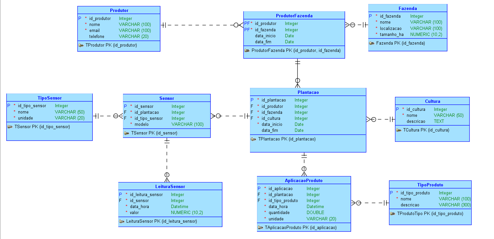

# 🌾 FarmTech Solutions – Sistema de Monitoramento Agrícola Inteligente
## 📘 Introdução
Este projeto foi desenvolvido pela equipe de alunos da FIAP como parte da atividade avaliativa do capítulo 10 ao 12 da disciplina de Banco de Dados. Somos parte da startup **FarmTech Solutions**, focada em soluções de Agricultura Digital.

O objetivo deste projeto é modelar um banco de dados relacional para um sistema que realiza o monitoramento de plantações por meio de sensores de umidade, pH e nutrientes (fósforo e potássio – NPK). Com isso, é possível otimizar a aplicação de água e nutrientes com base nos dados coletados.

## 🌐 Escopo do Projeto

Um produtor rural utiliza sensores para capturar informações sobre o solo e, com base nesses dados:

- Ajusta a quantidade de água e nutrientes aplicados.
- Acompanha a variação de pH ao longo do tempo.
- Otimiza os recursos utilizados na plantação.
- Faz previsões com base no histórico de dados.

## 📊 Objetivos Técnicos

1. **Modelagem do MER (Modelo Entidade Relacionamento)** com:
   - Entidades e atributos necessários
   - Cardinalidade de relacionamentos
   - Tipos de dados apropriados
   - Regras de negócio definidas

2. **Criação do DER (Diagrama Entidade Relacionamento)** utilizando o Oracle SQL Developer Data Modeler.

3. **Documentação do projeto em Markdown (README.md)** com explicação completa do MER.

---
## 🗃️ Modelo Entidade-Relacionamento (MER)

| Entidade A      | Relacionamento          | Entidade B          | Cardinalidade          |
|------------------|--------------------------|----------------------|--------------------------|
| Produtor         | Possui                   | Fazenda              | N:N (via ProdutorFazenda)|
| Fazenda          | Contém                   | Plantacao            | 1:N                      |
| Plantacao        | Tem                      | Cultura              | N:1                      |
| TipoSensor       | Define                   | Sensor               | 1:N                      |
| Plantacao        | Usa                      | Sensor               | 1:N                      |
| Sensor           | Gera                     | LeituraSensor        | 1:N                      |
| Plantacao        | Recebe                   | AplicacaoProduto     | 1:N                      |
| TipoProduto      | Aplicado em              | AplicacaoProduto     | 1:N                      |


---
## 🗂️ Estrutura do Repositório

```plaintext
📁 /
├── 📄 README.md
├── 📁 /modelo/
│   ├── 📁 /dataModeler/ → Arquivos do Oracle SQL Developer DataModeler
│   |   ├── 📁 /modelagem/
|   |   ├── modelagem.dmd
│   ├── 📁 /script/
|   |   ├── a_createTable.sql → Criar Tabelas
|   |   ├── b_insertTable.sql → Inserir dados para analise
|   |   ├── c_selecTable.sql → Select default das tabelas
|   |   ├── d_selectCustom.sql → Query que responde algumas perguntas do enunciado
│   ├── der.png        → Imagem do DER
```
